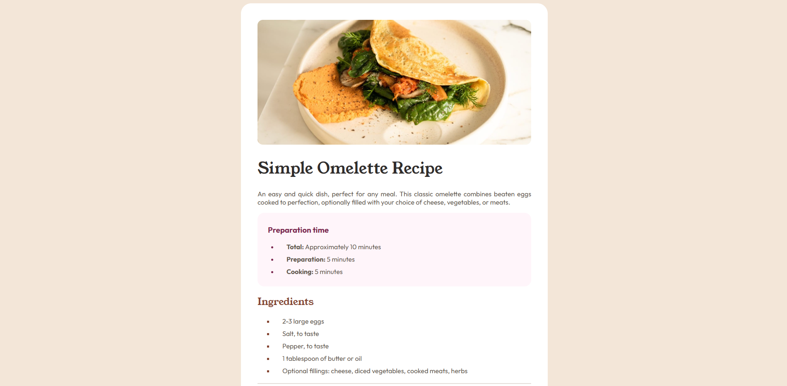
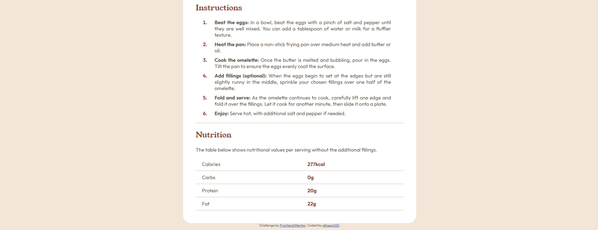

# Frontend Mentor - Solução para a Página de Receita

Esta é uma solução para o desafio da Página de Receita no Frontend Mentor, [Recipe page challenge on Frontend Mentor](https://www.frontendmentor.io/challenges/recipe-page-KiTsR8QQKm). Os desafios do Frontend Mentor ajudam você a melhorar suas habilidades de codificação ao construir projetos realistas.

## Table of contents

- [Overview](#overview)
  - [Screenshot](#screenshot)
  - [Links](#links)
- [Meu processo](#meu-processo)
  - [Construído com](#construido-com)
  - [O que eu aprendi](#o-que-eu-aprendi)
  - [Desenvolvimento contínuo](#desenvolvimento-continuo)
  - [Recursos úteis](#recursos-uteis)
- [Author](#author)
- [Agradecimentos](#agradecimentos)

## Overview

### Screenshot





### Links

- Solution URL: [Add solution URL here](https://your-solution-url.com)
- Live Site URL: [Add live site URL here](https://your-live-site-url.com)

## Meu processo

### Construído com

- Semantic HTML5 markup
- CSS custom properties
- CSS Grid

### O que eu aprendi

Durante o desenvolvimento deste projeto, aprendi várias coisas importantes e tive algumas dúvidas que me ajudaram a melhorar minhas habilidades com CSS:

Dúvida sobre o uso de font-weight no body: Inicialmente, eu tentava definir os valores de font-weight como 400, 600, 700, o que não era funcional, pois o CSS aceita apenas um valor específico de peso de fonte (ex.: font-weight: 400), e o ideal é definir o peso de fontes de forma explícita para cada uso. Isso me ajudou a entender a forma correta de aplicar o font-weight para fontes variáveis e não repetir valores como tentei inicialmente.

Exemplo corrigido:
```css
font-weight: 400; /* Definido apenas o peso de forma adequada */
```

Diferença entre hr e a linha na tabela: Eu estava com dificuldades para fazer a linha do `<hr>` ficar com a mesma espessura da linha inferior da tabela. Após investigar, percebi que o `<hr>` estava mais grosso devido ao padrão de estilo do navegador, então apliquei um estilo mais personalizado ao `<hr>`, ajustando a espessura e a cor para igualar à linha da tabela:

```css
.block-main hr {
  border: none;
  border-top: 2px solid var(--stone-150);
  margin: 20px 0;
}
```

Uso de variáveis CSS: Eu aprendi a usar as variáveis CSS de forma mais eficiente para gerir as cores e fontes no projeto. Isso facilitou a manutenção do código, tornando-o mais limpo e organizado.

Criar layouts responsivos com Flexbox e CSS Grid: Ao trabalhar com layouts complexos, tive que ajustar e melhorar o uso do Flexbox e do CSS Grid para garantir que o design se adaptasse a diferentes tamanhos de tela. Isso envolveu definir colunas e linhas corretamente, além de garantir que os itens se alinhassem bem em várias resoluções.

Exemplo de uso de grid:

```css
.container {
  display: grid;
  grid-template-columns: repeat(2, 1fr);
  gap: 20px;
}
```

Ajustes de margem e padding: Durante o desenvolvimento, enfrentei alguns desafios com o espaçamento de elementos, principalmente com a diferença entre as margens e o padding nas várias seções. Ajustei esses valores para garantir uma boa harmonia visual entre as áreas da página.

Exemplo de espaçamento ajustado:

```css
.block-main {
  padding: 40px;
  margin: auto;
  width: 35%;
}
```

### Desenvolvimento contínuo

Existem algumas áreas que quero continuar desenvolvendo:

- Aprimorar a acessibilidade: Quero garantir que o site seja o mais acessível possível para todos os usuários.
- Melhorar a performance: Aprender mais sobre técnicas de otimização de desempenho, como lazy loading e compressão de imagens.
- Aprofundar o uso de animações e transições: Embora eu tenha utilizado algumas animações simples neste projeto, quero explorar mais sobre animações CSS para melhorar a experiência do usuário.

### Recursos úteis

- [CSS Grid Layout](https://developer.mozilla.org/en-US/docs/Web/CSS/CSS_grid_layout) - Este recurso me ajudou a entender e implementar o layout de grid de forma eficiente.

## Author

- Website - [Add your name here](https://www.your-site.com)
- Frontend Mentor - [@yourusername](https://www.frontendmentor.io/profile/yourusername)

## Agradecimentos

Gostaria de agradecer ao Frontend Mentor por fornecer o desafio e à comunidade por toda a ajuda e feedbacks valiosos. Também agradeço ao meu professor de Linguagem Técnica de Programação 3 - ETB por ter me apresentado ao Frontend Mentor e me desafiado nessa revisão de HTML e CSS, o que me ajudou a melhorar minhas habilidades ao longo desse projeto.
